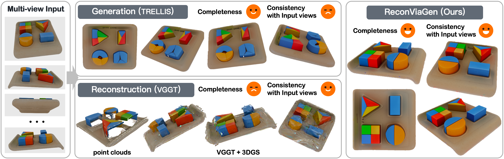

# ReconViaGen: Towards Accurate Multi-view 3D Object Reconstruction via Generation

<!-- <p align="center">
<a title="Website" href="https://jiahao620.github.io/reconviagen/" target="_blank" rel="noopener noreferrer" style="display: inline-block;">
  
  
</a>
</p> -->

<div align="center">

[](https://jiahao620.github.io/reconviagen)
[](https://arxiv.org/abs/2510.23306)
[](https://huggingface.co/spaces/Stable-X/ReconViaGen)

</div>



**Alpha Demo**: https://huggingface.co/spaces/Stable-X/ReconViaGen.
We welcome feedback on failure cases to help improve the model.

---

**🆕 News (v0.5)** — Releasing the inference code of ReconViaGen-v0.5 in the [v0.5 branch](https://github.com/GAP-LAB-CUHK-SZ/ReconViaGen/tree/v0.5?tab=readme-ov-file) of this repository! Thanks for the excellent work [TRELLIS.2](https://github.com/microsoft/TRELLIS.2)! We have proposed an effective multi-view fusion strategy for TRELLIS.2, and then we combine ReconViaGen with TRELLIS.2 to enable the generation of high-resolution meshes and PBR materials.
For details, please refer to the [v0.5 branch](https://github.com/GAP-LAB-CUHK-SZ/ReconViaGen/tree/v0.5?tab=readme-ov-file) of this repository.

<div align="center">

[](https://www.youtube.com/watch?v=sh5oPQLVDO0)

*Demo of ReconViaGen-v0.5*

</div>

**News (v0.2)** — Releasing the training and inference code of ReconViaGen-v0.2 in the [main branch](https://github.com/GAP-LAB-CUHK-SZ/ReconViaGen) of this repository! We have optimized the inference process. Reconstructing 16 images using ReconViaGen without refinement (app.py) consumes less than 18GB of VRAM.
Reconstructing 16 images using ReconViaGen (app_fine.py) consumes less than 24GB of VRAM.

**News (Community)** — An [unofficial implementation of ReconViaGen](https://github.com/estheryang11/ReconViaGen) is released! Thanks to [estheryang11](https://github.com/estheryang11) a lot!

---

## Installation

Clone the repo:
```sh
git clone --recursive -b v0.5 https://github.com/GAP-LAB-CUHK-SZ/ReconViaGen.git
cd ReconViaGen
```

You can choose to create a new conda environment named `reconviagen_v05` and install the dependencies (PyTorch 2.4.0 with CUDA 12.1):
```sh
. ./setup.sh --new-env --basic --xformers --flash-attn --cumesh --o-voxel --flexgemm --nvdiffrec --spconv --mipgaussian --kaolin --nvdiffrast --demo
```

Or you can update a previous conda environment `reconviagen`:
```sh
. ./setup_update.sh
```

---

## Local Demo 🤗

Run the script to reconstruct the object:
```sh
python app_v05.py
```

---

## Method Overview

ReconViaGen-v0.5 adopts a four-stage hybrid pipeline, combining ReconViaGen's multi-view-aware sparse structure estimation with TRELLIS.2's high-resolution generation:

**Stage 1 · ReconViaGen**
- Input: one or more RGBA images (video frame extraction is also supported)
- VGGT-based multi-view feature extractor generates sparse structure coordinates
- Output: sparse voxel coordinates at 32³ resolution

**Stage 2 · Shape SLat (TRELLIS.2)**
- Conditioned on the Stage 1 sparse coordinates, a Shape SLat Flow Matching model generates the Shape Sparse Latent
- Output: sparse latent encoding high-quality geometry
- Multi-image fusion strategies: `adaptive_guidance_weight` (default), `weighted_average`, `sequential`, etc.

**Stage 3 · Texture SLat (TRELLIS.2)**
- Conditioned on the Shape SLat from Stage 2, generates a Texture Sparse Latent with PBR material attributes (Base Color, Metallic, Roughness)
- Multi-image fusion strategies: `adaptive_guidance_weight` (default), `weighted_average`, `sequential`, etc.

---

## Multi-view Fusion Strategies

We explore six strategies, which are available via the `strategy` parameter. Empirically, **the `adaptive_guidance_weight` is the best choice.**

| Strategy | Passes / Step | Description |
| :--- | :---: | :--- |
| **`sequential`** | 2 | At denoising step *i*, uses `images[i % N]` as the sole condition — the cheapest option. Each step sees only one view, so multi-view coherence relies on the cyclic ordering of images across steps. |
| **`average`** | 2N | Runs full CFG independently for every image (1 uncond + 1 cond call **per view**), then averages the `pred_x_prev` tensors. Because CFG and its rescale are applied separately per image, a slight bias is introduced when `guidance_rescale > 0`. |
| **`average_right`** | N+1 | Correct Product-of-Experts (PoE) multi-image CFG. One shared uncond call + N cond calls; conditional velocities are **equally averaged**, then CFG (including rescale) is applied **once** on the blended result — eliminating the per-image rescale bias of `average` while halving the forward-pass cost. |
| **`weighted_average`** | N+1 | Same architecture as `average_right` (1 uncond + N cond, CFG once). At each denoising step, **per latent token**, the weight of view *i* is `softmax(−‖v_cond_i − mean_v‖)` where `mean_v` is the cross-view mean velocity. Views whose velocity deviates the least from the consensus receive higher weight, locally suppressing occluded or specular views without penalising them globally. |
| **`adaptive_guidance_weight`** | N+1 | Same architecture as `average_right`. Per-token weight = **guidance magnitude** `‖v_cond_i − v_uncond‖` — a direct proxy for how strongly the model "sees" the corresponding surface region under view *i* (occluded/specular regions produce small guidance signals and are naturally down-weighted). A t-adaptive temperature is used: early steps (t≈1) → near-uniform weights for stable global structure; late steps (t≈0) → sharpened weights so the most confident views drive fine-detail refinement. |
| **`fixed_guidance_rescale`** | N+1 | Theoretically correct PoE with **per-view independent rescale**. `average_right` computes the rescale reference from the *averaged* velocity, which under-estimates variance when views disagree. This strategy instead applies CFG at strength `gs/N` and rescale *independently* for each view (using each view's own `std(x0_cond_i)` as the reference), then combines via PoE: `v_final = Σᵢ v_i_rescaled − (N−1)·v_uncond`. Degrades exactly to `average_right` when `guidance_rescale=0` or all views agree. |

---

## Citation

```bibtex
@article{chang2025reconviagen,
        title={ReconViaGen: Towards Accurate Multi-view 3D Object Reconstruction via Generation},
        author={Chang, Jiahao and Ye, Chongjie and Wu, Yushuang and Chen, Yuantao and Zhang, Yidan and Luo, Zhongjin and Li, Chenghong and Zhi, Yihao and Han, Xiaoguang},
        journal={arXiv preprint arXiv:2510.23306},
        year={2025}
}
```
